# Desk Guardian
### Proximity-based Workspace Awareness System
**TECHIN 514 · Taya (Xintong) Li · University of Washington**

---

## Overview

Desk Guardian is a two-device IoT system that detects how close someone is to your desk and communicates that proximity through a physical gauge and ambient LED — passively, without any interaction required.

In shared workspaces, personal boundaries are often invisible. There is no ambient signal that tells others whether someone is available or focused. Desk Guardian solves this by turning proximity data into a real-time physical display.

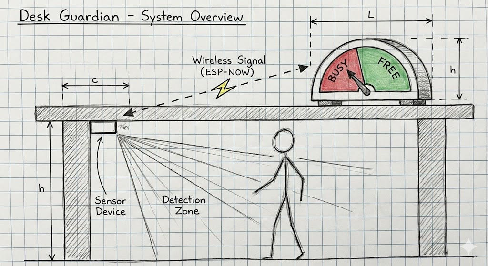

---

## System Architecture

Two XIAO ESP32C3 devices communicate over BLE. The sensor device reads distance and classifies proximity state; the display device receives the state and updates the motor pointer and LED accordingly.

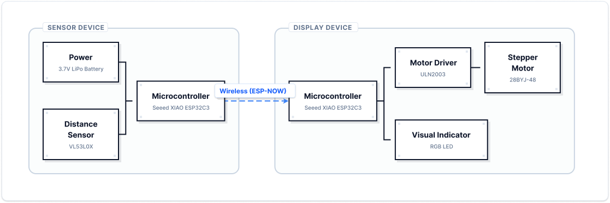

```
Sensor Device (BLE Client)          Display Device (BLE Server)
──────────────────────────          ───────────────────────────
XIAO ESP32C3                        XIAO ESP32C3
HC-SR04 Ultrasonic Sensor           28BYJ-48 Stepper Motor + ULN2003
Custom PCB + LiPo Battery           RGB LED + Push Button
                                    Custom PCB + LiPo Battery

TRIG → D9   ECHO → D8               Motor → D0–D3
                                    LED   → D4–D6
                                    BTN   → D10
```

**BLE Config**
- Service UUID: `6f4e0001-1111-2222-3333-444455556666`
- Characteristic UUID: `6f4e0002-1111-2222-3333-444455556666`
- Device name: `Taya_Display_Server`

---

## Proximity States & Logic Flow


| State | Distance | LED | Motor |
|-------|----------|-----|-------|
| SAFE | > 150 cm | Blue (solid) | Pointer left |
| APPROACHING | 45–150 cm | Red (blink) | Pointer center |
| TOO CLOSE | < 45 cm | Red (solid) | Pointer right |

**Auto-reset:** TOO CLOSE held for 3s with no change → auto-send APPROACHING + 5s cooldown. If person leaves → immediate reset to SAFE.

**Hysteresis:** TOO CLOSE exits at > 60 cm · SAFE exits at < 130 cm — prevents state flickering at threshold boundaries.

---

## Hardware

### Sensor Device

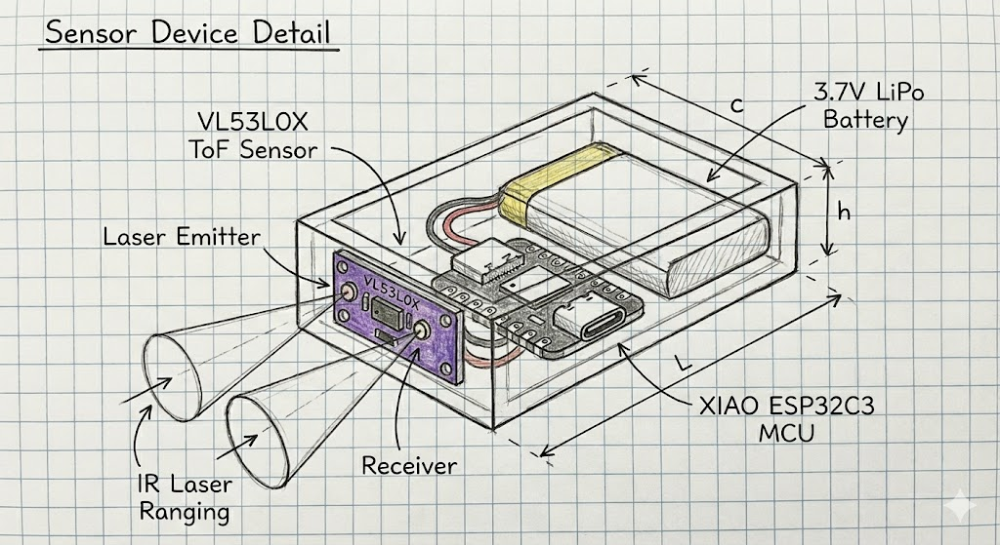

### Display Device

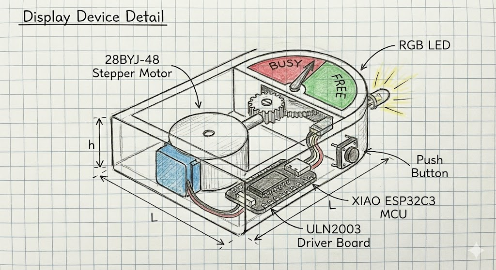

| Component | Qty | Notes |
|-----------|-----|-------|
| Seeed Studio XIAO ESP32C3 | 2 | One per device |
| HC-SR04 Ultrasonic Sensor | 1 | Sensor device |
| 28BYJ-48 Stepper + ULN2003 | 1 | Display device |
| 3.7V 1000mAh LiPo Battery | 2 | One per device |
| Custom PCB | 2 | KiCad, lab-fabricated |
| RGB LED | 1 | Display device (green channel non-functional in v1) |
| Push Button | 1 | On/off toggle |

**Power note:** Display device draws ~340mA peak (stepper active). USB power required during use. Future iteration will upsize battery capacity.

---

## Build Photos

| Both Devices | Sensor PCB | Sensor PCB |
|---|---|---|
| 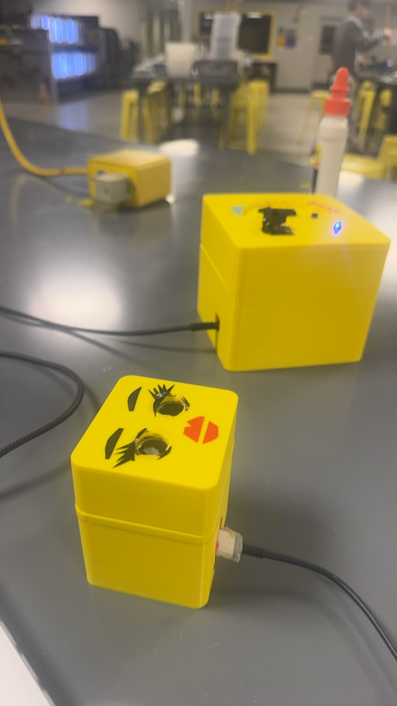 | 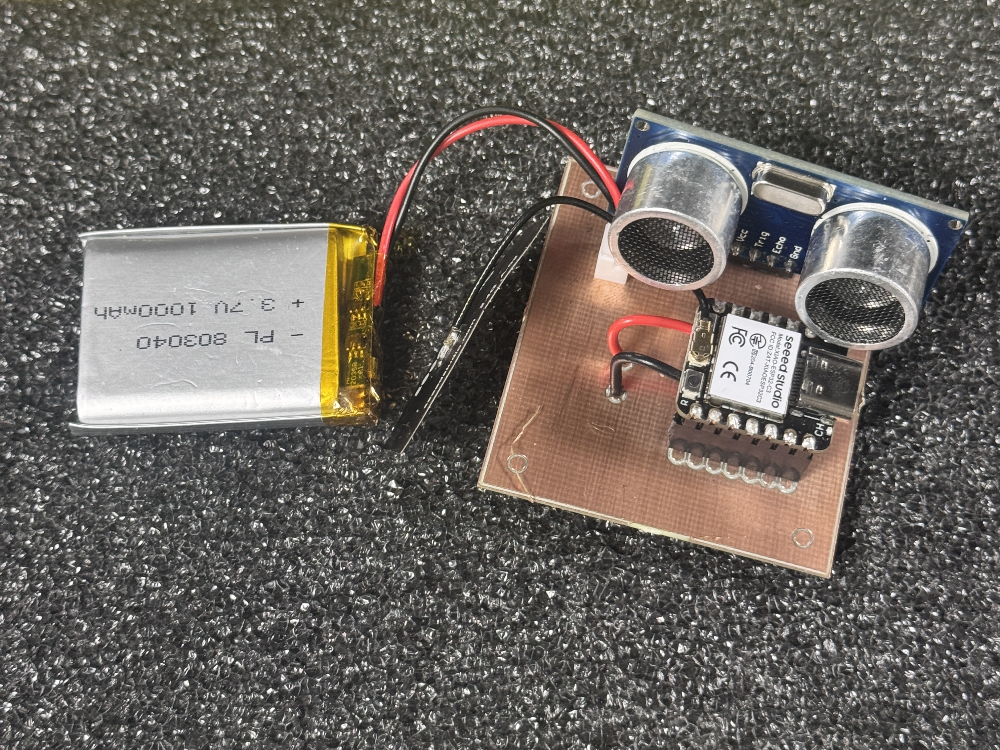 | 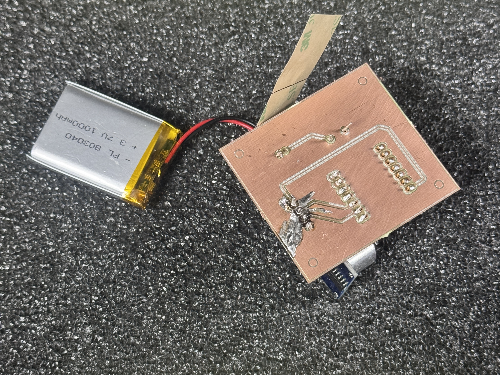 |

| Display Internal | Display Internal | Display Enclosure |
|---|---|---|
| 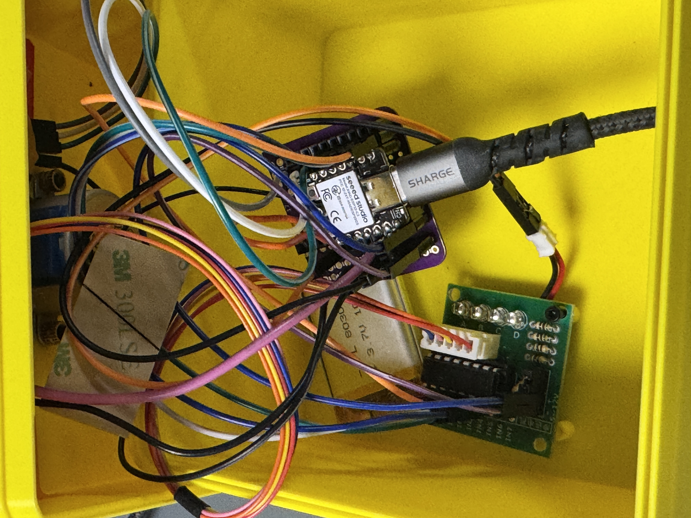 | 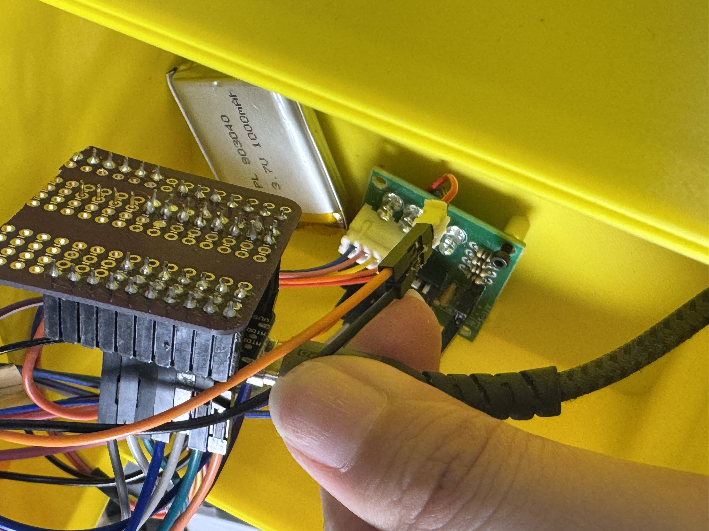 | 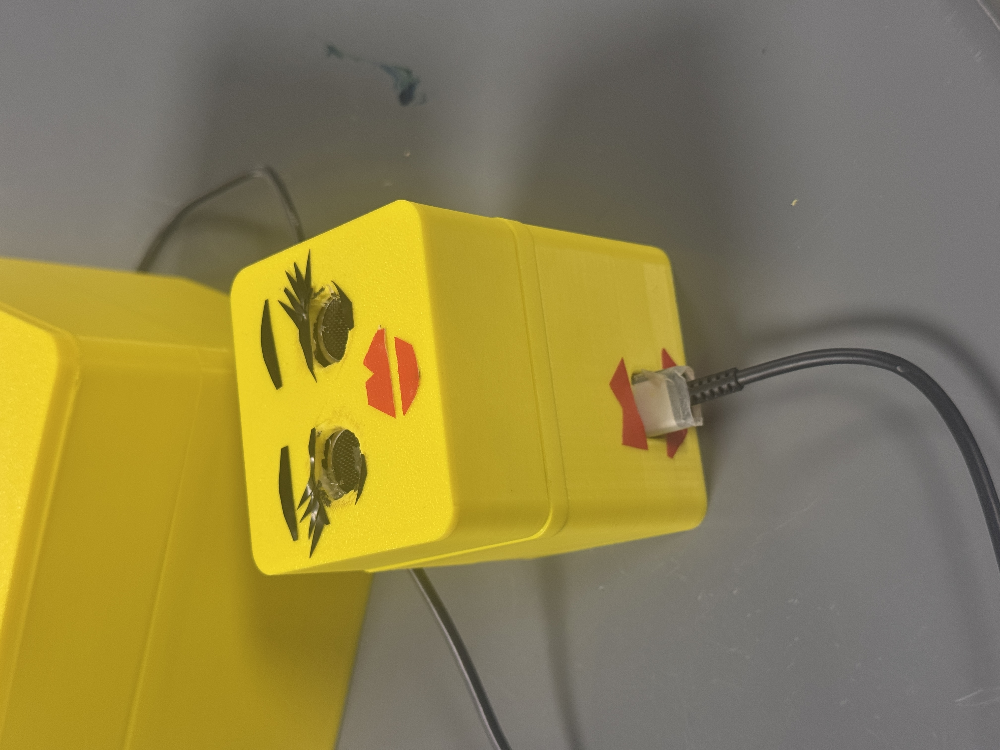 |

| Display Enclosure | Display Enclosure |
|---|---|
| 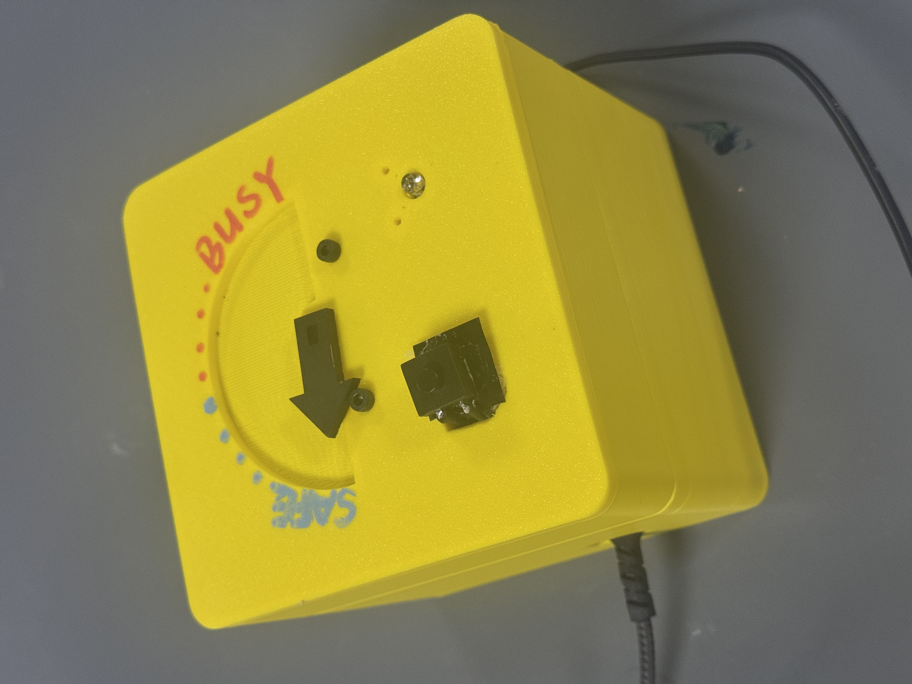 | 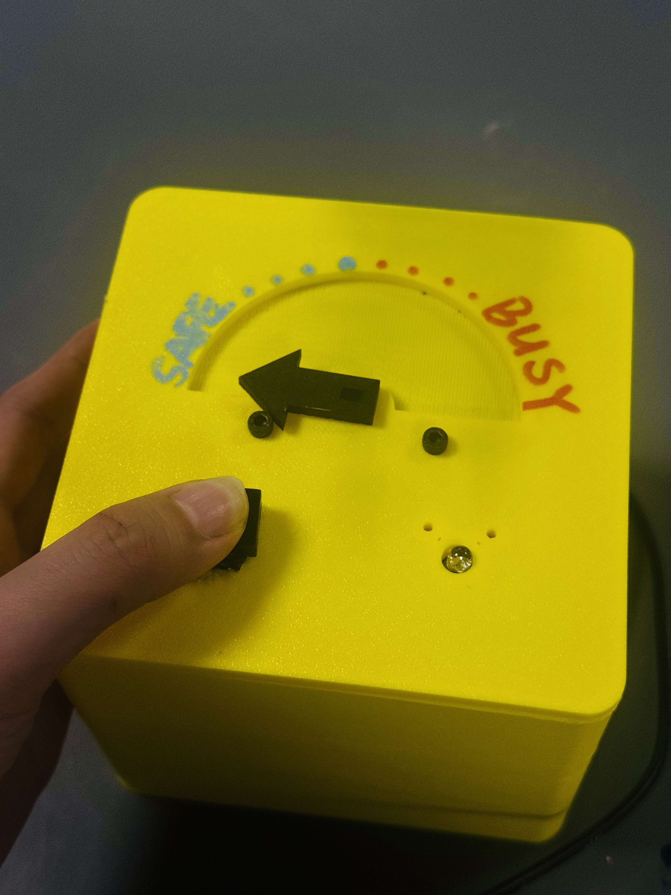 |

---

## Signal Processing Pipeline

1. **Read** — HC-SR04 polled every 100ms via TRIG/ECHO GPIO
2. **Smooth** — 3-sample moving average; timeouts filled with last valid reading
3. **Classify** — State machine with hysteresis applied
4. **Send** — BLE characteristic write, only on state change

---

## Build & Flash

Both devices use PlatformIO with Arduino framework.

```ini
[env:seeed_xiao_esp32c3]
platform = espressif32
board = seeed_xiao_esp32c3
framework = arduino
monitor_speed = 115200
```

Flash display device first, then sensor. Sensor will scan for `Taya_Display_Server` on boot and connect automatically.

---

## Repository Structure

```
Project/
├── README.md
├── code/
│   ├── sensor/          # BLE client, HC-SR04 distance detection
│   │   ├── main.cpp
│   │   └── platformio.ini
│   └── display/         # BLE server, stepper + LED control
│       ├── main.cpp
│       └── platformio.ini
├── schematic/           # KiCad schematic files
├── pcb/                 # KiCad PCB layout files
├── cad/                 # 3D print STL files
├── ppt/                 # Final presentation
├── images/              # Device photos
├── datasheet/           # Component datasheets
└── archive/             # Original proposal and early schematics
```

---

## Known Issues & Future Work

- **Power** — Display device requires USB power; LiPo capacity needs to be upsized
- **Enclosure** — Display enclosure too large; USB port opening at wrong height; sensor aperture too small in v1
- **LED** — Green channel non-functional in v1; limited to red/blue only
- **Thresholds** — Distance thresholds are environment-dependent; future version should support configurable parameters or auto-calibration
- **BLE** — Occasional disconnects; auto-reconnect to be implemented

---

## Demo

[Video Demo](https://drive.google.com/file/d/1y1JuozKeC6GTdT54zdWIaoLAR-elOvjI/view?usp=drive_link)

---

## Original Proposal

[View archived proposal](archive/archive_proposal)

---

*TECHIN 514 Connected Devices · University of Washington MSTI*
