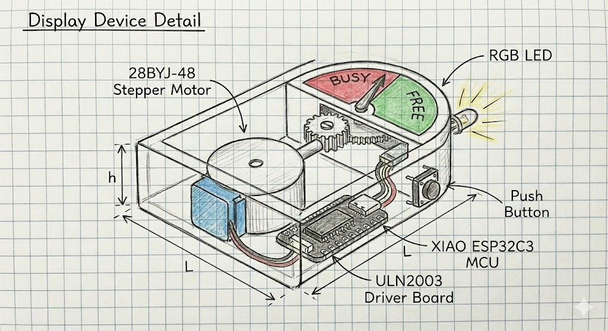

# Desk Guardian
## Proximity-based Interruption Awareness System

### Part 1: Overview

#### Project Description

Desk Guardian is a desk-based system designed to make interruptions and personal space more visible in shared work environments. The system detects when someone approaches a desk and translates proximity information into a clear contextual signal.

#### System Architecture

The system consists of two separate devices that communicate wirelessly:

- **Sensing Device**: Placed near the desk to monitor proximity
- **Display Device**: Placed on the desk to provide physical feedback

#### Functionality

A distance sensor measures how close a person is to the desk area. The sensor data is processed using simple smoothing and time-based thresholding to distinguish brief passersby from sustained presence. When an interruption condition is detected, the processed signal is sent wirelessly to the display device. The display device communicates the current context through a motor-driven gauge and LED feedback, indicating whether the user is available for interruption.

#### Components

**Sensing Device**
- Distance sensor
- ESP32

**Display Device**
- Stepper motor (for gauge)
- LED
- Button (reset / mode selection)
- Custom PCB

#### Notes

Sketches used in this project were generated with the assistance of AI tools to support visualization and conceptual clarity.

*Figure 1: Conceptual sketch of the Desk Guardian system layout.*

### Part 2: Sensor Device

#### Description

The sensor device is placed on the desk edge to detect when someone approaches the desk area. It continuously measures distance and processes the data to determine when an interruption condition occurs.

#### Key Components

- **Microcontroller**: Seeed Studio XIAO ESP32C3
- **Sensor**: VL53L0X Distance sensor
- **Power**: 3.7V LiPo Battery

#### Logic

The device measures distance continuously. If someone stays within close range (e.g., less than 80cm) for a sustained period of several seconds, the device sends a wireless signal to the display device indicating an interruption condition.

*Figure 2: Detailed sketch of the Sensor Device showing the VL53L0X and XIAO ESP32C3.*

### Part 3: Display Device

#### Description

The display device sits on the desk to show the user's availability status through physical indicators. It receives wireless signals from the sensor device and updates the status accordingly.

#### Key Components

- **Microcontroller**: Seeed Studio XIAO ESP32C3
- **Motor**: 28BYJ-48 Stepper Motor (drives a pointer gauge)
- **Driver**: ULN2003 Driver Board (required for motor control)
- **Light**: RGB LED (provides color status indication)
- **Input**: Button (for resetting status)

#### Logic

The device receives wireless signals from the sensor device. When a "Busy" signal is received, the stepper motor moves the pointer to indicate busy status and the RGB LED turns red. When a "Free" condition is detected or the button is pressed, the device resets to show available status.

*Figure 3: Mechanical detail of the Display Device showing the stepper motor and gauge assembly.*

## Part 4: System Communication & Logic

The system utilizes **ESP-NOW**, a low-latency, peer-to-peer wireless protocol, allowing the two devices to communicate directly without needing a Wi-Fi router.

### System Architecture
The diagram below illustrates the hardware architecture and the wireless link between the Sensing Node and the Display Node.

*Figure 4: System Block Diagram showing hardware connections and wireless link.*

### Data Flow & Logic
The following steps describe the complete process from physical detection to mechanical feedback:

1.  **Measure:** The **Sensor Device** continuously reads distance data (in mm) from the VL53L0X sensor.
2.  **Process:** The MCU applies a smoothing algorithm. It checks if `Distance < 80cm` AND `Duration > 2 seconds` to confirm a valid interruption (filtering out passersby).
3.  **Transmit:** The Sensor Device sends a data packet (`Status: BUSY` or `Status: FREE`) via ESP-NOW.
4.  **Actuate:** The **Display Device** receives the packet:
    * **If BUSY:** The Stepper Motor rotates the pointer +90 degrees to the Red Zone, and the LED turns Red.
    * **If FREE:** The Stepper Motor reverses to the Green Zone, and the LED turns Green.

*Figure 5: Data Flow Diagram illustrating the sensing and decision logic.*

## Appendix: Process Sketches
Below is the original conceptual sketch created during the ideation phase.

*Original ideation sketch.*

---
**Note on AI Usage:** Due to my limited prior experience in this domain, I utilized AI assistants as a learning aid to understand the hardware development workflow, validate the technical feasibility of my ideas, and identify appropriate component models. Additionally, AI tools were used to refine the document's structure and generate the project visualizations based on my original hand-drawn sketches (provided in the Appendix).
